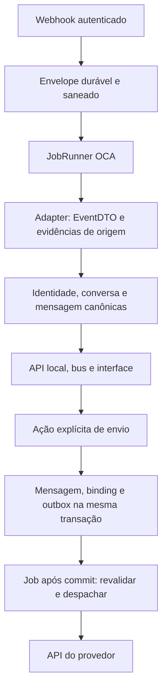

# Arquitetura do Contact Center

[Voltar ao README](../README.md) · [CRM e atribuição](crm-and-attribution.md) ·
[Roadmap](roadmap.md)

Este documento descreve os contratos atuais do código Odoo 16. Datas de implantação,
resultados de testes e decisões de uma entrega específica pertencem ao histórico; não
substituem a verificação do ambiente que será atualizado.

## Responsabilidades dos módulos

| Módulo                  | Responsabilidade                                                                         | Dependências diretas                       |
| ----------------------- | ---------------------------------------------------------------------------------------- | ------------------------------------------ |
| `contact_center_base`   | Conversas, identidades, acesso, inbox/outbox, mídia, evidência de origem e produtividade | `mail`, `queue_job`, `rating`, `web`       |
| `contact_center_ui`     | Caixa de atendimento Owl sobre a API local                                               | Base e `web`                               |
| `contact_center_wuzapi` | Transporte WhatsApp e normalização do provedor                                           | Base                                       |
| `contact_center_meta`   | Messenger e Instagram vinculado a Página                                                 | Base, `meta_api_base`, `meta_webhook_base` |
| `contact_center_crm`    | Painel comercial do cliente e associação explícita conversa–CRM                          | UI e `crm`                                 |
| `contact_center_kanban` | Atendimentos, pipelines, ações CRM, sincronização de etapas e integrantes                | Contact Center CRM                         |

As fundações Meta são distribuídas pelo
[Marketing Center](https://github.com/soloztech/marketing-center/tree/16.0). Isso não
torna os módulos funcionais de marketing dependências do inbox.

## Registros canônicos e identidade

`mail.channel` é a conversa; `mail.message` é a mensagem. Os bindings guardam os
identificadores externos, direção e contexto do transporte sem substituir esses
registros nativos. A interface usa a API local versionada e não modifica JavaScript
privado do Discuss ou Live Chat.

A pessoa remota usa `mail.guest`, uma identidade durável e aliases. O vínculo com
`res.partner` é uma ação explícita. PN de WhatsApp comprovado pelo protocolo pode ser
resolvido entre caixas da mesma empresa. LID, JID opaco, PSID e IGSID conservam seu
escopo de caixa. Empresas operadoras permanecem isoladas.

Vincular um contato não mescla conversas nem cria um lead. A empresa principal segue
`res.partner.parent_id` e `commercial_partner_id`; relações secundárias não concedem
acesso a documentos. Consulte o
[contrato de relações entre pessoa e empresas](../research/partner-company-relationships.md).

## Caixa, conexão e acesso

Uma conta representa uma caixa lógica. As conexões de transporte têm papéis `primary`,
`standby`, `migration` ou `historical`. Somente a primária ativa admite tráfego; o envio
ainda depende da habilitação de saída, saúde e identidade verificadas. Trocar a conexão
não altera as referências de mensagens já enviadas pelo provedor anterior.

O acesso atual usa `access_user_ids` e `access_team_ids`, ambos cumulativos. A união dos
usuários diretos e integrantes autorizados das equipes determina o público da caixa; as
participações nativas no canal refletem essa autoridade. Revogar acesso remove a
participação que perdeu seu fundamento. Responsável pela conversa e atribuição
automática continuam escolhas singulares, limitadas aos usuários autorizados.

Os nomes antigos `owner_user_id` e `default_team_id` encontrados em pesquisas e planos
não descrevem os campos atuais de concessão de acesso. A migração é documentada em
[account-access-upgrade.md](../operations/account-access-upgrade.md). Equipe de um
Atendimento é contexto de negócio e não constitui uma segunda concessão de acesso à
conversa.

## Listagem, detalhe e invalidações

A listagem da UI usa a projeção opt-in `list_v1`; integrações que omitem a projeção
continuam recebendo o DTO completo. O serializer compacto e seu prefetch dedicados
mantêm nome resolvido, foto, preview, preferência, contadores, tags, responsável e os
sete campos leves de grupo. Os únicos capabilities da linha são os dois booleanos dos
menus de excluir/ignorar. Os endpoints reautorizam cada operação.

O store mantém o detalhe autorizado apenas para a seleção/operação de abertura atual.
Clique em linha inicia `get_conversation` e timeline em paralelo; abertura dirigida,
chat, restauração e início de conversa reutilizam o fullitem autorizado da mesma
operação. Fechar/trocar a seleção encerra a validade do detalhe; reabrir uma linha exige
nova autorização. A linha jamais recebe partner, aliases, retenção ou políticas de
envio.

`selectedConversation` combina os escalares leves recentes da linha com o snapshot de
detalhe. Identity/account conservam seus campos adicionais quando os IDs coincidem;
mudança de ID invalida o detalhe. Group conserva campos adicionais; capabilities de
ações vêm do detalhe e os dois capabilities de menu vêm da linha. Retenção e os demais
campos omitidos na lista têm autoridade exclusiva no detalhe. Apenas atualizações do
detalhe reconciliam atribuição/linkers. Refresh da linha não reinicia forms, drafts ou o
painel CRM.

No primeiro loading/error, composição e painéis sensíveis aguardam detalhe. Um erro
transiente conserva seleção e timeline, tem erro visível e retry somente de detalhe, com
uma tentativa automática adicional limitada. Durante revalidação, o último snapshot
autorizado e suas permissões continuam utilizáveis, conforme a regra anterior da UI; o
servidor reautoriza as ações. Negação atual remove detalhe, permissões e painel.
Respostas de outra seleção, epoch ou geração não revogam uma seleção posterior. Mudanças
auth/company limpam os detalhes antes da aplicação de respostas.

Respostas de mutações conservam os guards de epoch, lifetime da seleção e revisão do
detalhe aplicado. Se somente a revisão avançou na mesma seleção/contexto, a resposta não
sobrescreve o detalhe mais recente e agenda sincronização urgente, inclusive na
preservação de retenção. Mutações sobrepostas e refresh entre request/answer convergem
ao estado atual do servidor sem depender de bus ou repair. Resposta de seleção/contexto
encerrado não agenda refresh da seleção nova.

A matriz em [event-taxonomy.md](event-taxonomy.md) distingue avatar, três escopos de
metadata e os caminhos completos. Nome/aliases/grupo nunca são patches locais de bus:
`reconcile_conversations` recompõe a janela autorizada e só serializa os afetados na
interseção da janela. Mudanças de ordem/acesso/filtro retornam fallback sem IDs
invisíveis. Search, unread-only, janela vazia ou maior que 100, paginação em voo,
tail/bulk incertos, revisão de filtros divergente ou seleção preservada fora do domínio
usam refresh completo. Nome/aliases estritos da seleção também renovam seu detalhe, sem
timeline. O label de autor inbound após rename pode conservar o nome anterior até o
reparo nativo de 30s, quando a aba está visível e as leituras funcionam; esse atraso
cosmético é aceito. `group_metadata` também altera roster/own-participant e permissões
das ações de mensagens: na seleção exige lista compacta, detalhe autorizado e timeline;
fora da seleção permanece na lane delta. Falha de delta após aplicação parcial agenda
fallback completo de metadata pelo owner existente, recupera detalhe/avatar coalescido e
preserva flags concorrentes mais fortes, sem loop externo e com deadline/backoff
nativos. Mensagens, identity/reaction/media e eventos desconhecidos mantêm o caminho
completo. O reparo de conversas de 30s e o reparo de resumo de 5min continuam
independentes do bus.

`member_seen` próprio ou de terceiros e `member_fetched` atualizam somente os guards de
leitura/bulk aplicáveis, sem refresh rotineiro do Store. O próprio eco de leitura
durante bulk incerto conserva a conferência existente. A systray ignora `member_fetched`
e leituras de terceiros; leitura própria conserva seu recount anterior. Effects de
timeline/chat dependem de IDs/booleanos estáveis e dos campos unread/estado existentes,
evitando reiniciar retry de `mark_seen` por um render sem mudança relevante. Memoização
do snapshot combinado e otimização de contexto em render ficam adiadas; os getters
mantêm a barreira auth/company, sem alegação de ganho de CPU.

## Reads de saúde compartilhados na aba

O serviço opcional `contact_center_ui.shared_reads` compartilha somente transportes
`contact.center.ui.api/get_connection_health` idênticos ainda em andamento entre os
stores reais de inbox e janelas de chat. A chave inclui modelo/método/args/kwargs,
usuário, empresa principal, empresas ativas na ordem original, idioma/fuso e contexto
RPC completo. Valores não JSON plain não entram no compartilhamento. Cada consumidor
recebe promise abortable e clone próprios. Abortar um consumidor não afeta os demais; o
último abort cancela o transporte. Cada `AutomaticReadOwner` mantém deadline de 30s. O
pool remove entradas ao settle, sem cache de resultado ou TTL.

Gerações causais de saúde são invalidadas pelo listener central antes dos stores
agendarem reads após `connection_health_updated` e reconnect. Settle de
`check_connection_health`, sucesso ou erro, invalida a geração antes do próximo GET; GET
e `refreshConnectionHealth` não invalidam por si. Reads anteriores podem terminar sob
seus guards nativos, mas novos consumidores não podem se juntar ao transporte anterior.
Epochs de auth/company são conferidos ao admitir e entregar resposta e cancelam
consumidores antigos. Componentes sem esse serviço usam o ORM diretamente.

Há um único SystraySummary real por aba e ele conserva seu próprio coalescing. O ganho
verificável desta entrega é a RPC inflight intratab entre stores, sem alegar uma segunda
instância de systray. SharedWorker/BroadcastChannel cross-tab foram avaliados e adiados:
exigem outro protocolo de ACL/lifecycle e não há evidência de ganho que justifique esse
protocolo nesta entrega. Não há identidade por IP, cache persistente ou cross-tab.

## Entrada, saída e filas

```mermaid
flowchart TD
    P["Webhook autenticado"] --> I["Envelope durável e saneado"]
    I --> Q["JobRunner OCA"]
    Q --> D["Adapter: EventDTO e evidências de origem"]
    D --> C["Identidade, conversa e mensagem canônicas"]
    C --> UI["API local, bus e interface"]
    UI --> A["Ação explícita de envio"]
    A --> O["Mensagem, binding e outbox na mesma transação"]
    O --> J["Job após commit: revalidar e despachar"]
    J --> V["API do provedor"]
```

Adapters autenticam, traduzem e transportam. O Base resolve identidade e cria os
registros do domínio. Inbox e outbox são registros persistentes de processamento;
`queue_job` executa os trabalhos, controla concorrência e agenda novas tentativas. O
composer e o webhook não enviam diretamente ao provedor.

Chaves de deduplicação e UUIDs de requisição tornam repetições reconhecíveis. O envio
registra uma fronteira durável antes da chamada externa. Um resultado `uncertain`
aguarda evidência; não recebe reenvio cego. Reenvio explícito de falha terminal elegível
cria uma nova tentativa vinculada à anterior. Saúde recuperada só retoma trabalho
compatível com a configuração e que ainda não cruzou essa fronteira.

Mídia, avatares e miniaturas ficam em anexos privados. Downloads e enriquecimentos
ocorrem em tarefas limitadas; credenciais e URLs privadas do provedor não entram na API
operacional ou no bus. Consulte
[resiliência e capacidade](../operations/resilience-capacity-drill.md) e os contratos de
[mídia](../research/wuzapi-media-transport.md) e
[saúde da sessão](../research/wuzapi-session-lifecycle.md).

## Conversa, Atendimento e CRM

A conversa usa `open`, `resolved` e `archived`. Uma mensagem nova aceita reabre uma
conversa resolvida; uma arquivada exige restauração explícita. Replay, recibo e mutação
não equivalem a uma nova mensagem humana.

Notas internas, respostas rápidas, mensagens agendadas e acompanhamentos pertencem ao
Base. Acompanhamentos são da conversa e não exigem Kanban. O addon opcional Kanban
acrescenta casos com pipelines e histórico próprio de transições; a etapa de um caso não
substitui o estado operacional da conversa.

O painel CRM lê documentos do cliente comercial com as permissões nativas. Sua consulta
não cria associação com a conversa. `contact.center.crm.conversation.link` conserva essa
associação explícita. O Kanban acrescenta ações próprias de criação/vínculo e a projeção
de casos em etapas CRM. Seus vínculos de pipeline e de integrantes têm ciclos separados.
Consulte [CRM e atribuição](crm-and-attribution.md) para o fluxo de uso.

## Evidência de aquisição

Touchpoints conservam observações, nível de evidência e identificadores com papéis
próprios. `fbads` isolado é um sinal do provedor, não uma campanha identificada nem uma
decisão de criação de lead. Cartões de anúncio exibem contexto disponível; a exibição
também não cria associação comercial.

As pontes opcionais do Marketing Center consomem essas evidências e os vínculos CRM. Há
catálogo Meta e resolução correspondente. A associação automática de campanha externa a
UTMs nativas e a consulta GCLID → `click_view` → campanha ainda não são fluxos
implementados do produto. Veja o
[atribuição nativa](https://github.com/soloztech/marketing-center/blob/16.0/docs/native-campaign-attribution.md).

A [entrada automática no CRM](crm-intake.md) pertence a `contact_center_crm`, é
desabilitada por padrão e exige ativação por caixa comercial. Criação ou reutilização de
negócio não confirma período comercial nem unifica identidades.

## Conteúdo, retenção e extensões

Excluir, ignorar, resolver e preservar histórico são operações distintas. Retenção por
prazo para grupos já existe, desabilitada por padrão, com exceção por conversa e
barreira contra recriação de conteúdo expirado. O lote preserva registros comerciais,
protege trabalho em andamento e adia dependências sem contrato seguro de expiração. A
coleta física dos arquivos continua a cargo do Odoo.

O contrato de extensão para retenção é implementado em
[retention_dependencies.py](../contact_center_base/models/retention_dependencies.py).
Novos consumidores devem preservar seus fatos e liberar apenas suas referências antes de
permitir expiração. O
[estudo de retenção](../research/message-retention-proposal-2026-09-11.md) separa o
resumo implementado das propostas originais; a ocorrência de “futuro” no estudo não
implica ausência do recurso no código atual.

Guias de operação preservados:

- [Ações da conversa](../operations/conversation-actions.md).
- [Prévias de anúncio](../operations/ad-origin-preview.md).
- [Transcrição de áudio](../operations/audio-transcription.md).
- [Extração CRM para instalações antigas](../operations/crm-independent-upgrade.md).
- [Cutover e rollback](../operations/production-cutover-rollback.md).

As instruções de publicação em `AGENTS.md` prevalecem sobre versões, datas e tags
citadas em procedimentos antigos. Uma mudança exige identificar sua origem e escopo; a
presença de um runbook não autoriza executar seus comandos.

A jornada comercial, escopo por negócio e diagrama de tracking estão em
[crm-journey.md](crm-journey.md).
