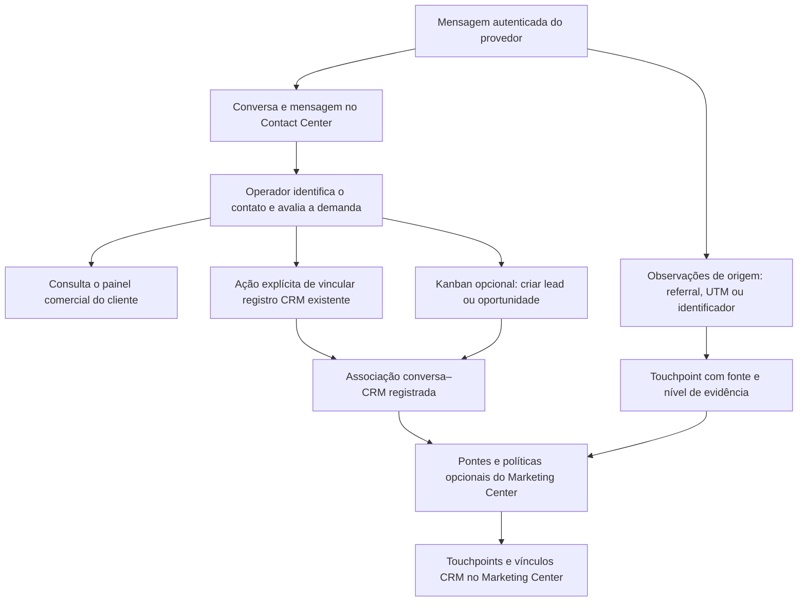

# Contact Center: conversas, CRM e atribuição

Este guia explica o comportamento do código da branch `16.0`. Ele não comprova que um
módulo ou uma configuração esteja ativo em um ambiente específico. Consulte o
[README técnico](../README.md) para instalação, transporte, filas e limites dos
provedores.

## O que cada projeto faz

| Camada                  | Responsabilidade                                                            | Dependências relevantes                    |
| ----------------------- | --------------------------------------------------------------------------- | ------------------------------------------ |
| `contact_center_base`   | Caixas, identidades, conversas, mensagens, filas e evidência de origem      | `mail`, `rating`, `web`, `queue_job`       |
| `contact_center_ui`     | Caixa de atendimento e ações do operador                                    | Base e `web`                               |
| `contact_center_crm`    | Painel comercial do cliente e registro separado de associações conversa–CRM | UI e CRM nativo                            |
| `contact_center_kanban` | Atendimentos, criação/vínculo explícito no CRM e sincronização de etapas    | Contact Center CRM                         |
| `contact_center_wuzapi` | Transporte WhatsApp e normalização das observações do provedor              | Base                                       |
| `contact_center_meta`   | Messenger e Instagram vinculado a uma Página                                | Base, `meta_api_base`, `meta_webhook_base` |

As duas fundações Meta vêm do
[Marketing Center](https://github.com/soloztech/marketing-center/tree/16.0). Elas podem
ser usadas sem instalar seus módulos funcionais de marketing. `marketing_center_meta`
cuida de catálogo, relatórios e submissões de formulários nativos Meta;
`marketing_center_meta_crm` acrescenta a entrada configurável dessas submissões no CRM.
Uma conversa do Messenger ou WhatsApp não é uma submissão de formulário.

Para as políticas de entrada de leads, resolução de campanha e UTMs nativas, consulte o
[contrato de CRM e atribuição do Marketing Center](https://github.com/soloztech/marketing-center/blob/16.0/docs/crm-intake-and-attribution.md).

## Da conversa à ação comercial

O operador pode atender, resolver ou arquivar uma conversa sem criar um lead. Vincular
um contato também não cria um registro comercial. A associação com CRM é uma decisão
separada, e as observações de marketing continuam sendo evidências dessa jornada.

Um sinal `fbads` é uma pista do provedor. Ele não significa demanda qualificada,
campanha identificada ou autorização para criar um lead. Mesmo um identificador de
anúncio ou clique válido precisa ser interpretado no seu papel e escopo.

## Painel de cliente não é associação comercial

1. Abra uma conversa à qual você tenha acesso e confira o contato vinculado.
2. Use o ícone de aperto de mãos para abrir o painel **Comercial**.
3. Consulte oportunidades, cotações, pedidos e faturas. A busca considera o cliente
   comercial (`commercial_partner_id`), a empresa da caixa e as permissões nativas.
4. Abra o documento na tela nativa quando precisar consultá-lo ou alterá-lo.

Duas conversas do mesmo cliente podem mostrar os mesmos documentos. Isso não vincula
cada documento às duas conversas e não muda a atribuição de marketing. O registro de
associação `contact.center.crm.conversation.link` é separado dessa consulta.

Sales e Accounting são opcionais. Uma aba fica indisponível quando falta o módulo ou
acesso de leitura; o addon não concede permissões financeiras. Quando permitido, **Nova
Cotação** abre o formulário nativo com cliente e empresa preenchidos; o usuário salva
explicitamente. Essa ação não cria um lead.

## Kanban opcional: quando criar ou vincular CRM

Instale o Kanban quando precisar de **Atendimentos**, pipelines e etapas sincronizadas.
O painel comercial e os acompanhamentos da conversa funcionam sem ele.

Antes das ações comerciais, um administrador deve configurar o vínculo do pipeline com a
equipe de vendas e o mapeamento das etapas. Um vínculo opcional de integrantes precisa
apontar para a mesma equipe. Sugestões do inventário de mapeamentos exigem aceitação
explícita do administrador.

No Atendimento, o operador autorizado escolhe uma ação:

- **Criar lead** ou **Criar oportunidade**: define explicitamente esse tipo, a empresa,
  equipe e etapa mapeadas. A criação deixa o vendedor vazio e aproveita um contato já
  vinculado, quando disponível; não cria contato por inferência.
- **Vincular CRM**: utiliza um registro existente, validando acesso, empresa, equipe e
  etapa. Não cria um segundo lead.
- **Desvincular CRM do Atendimento**: encerra a projeção do caso com evidência de
  desvinculação e preserva a associação da conversa. Remover a associação da conversa
  encerra suas projeções ativas correspondentes. O registro CRM permanece.

O tipo explícito dessas ações do Kanban é independente da opção `native` nas rotas de
entrada do Marketing Center. Um Atendimento criado automaticamente para organizar uma
conversa também não é um lead automático.

Para casos vinculados, uma transição permitida e mapeada atualiza a etapa no CRM; as
mudanças do CRM se refletem nos casos associados. Vínculo de integrantes e vínculo de
pipeline têm ciclos distintos: desligar a sincronização de integrantes não encerra as
associações comerciais nem a projeção de etapas.

## Como interpretar a origem

| Observação                                   | O que permite afirmar                                                                | O que ainda precisa ser verificado                                                |
| -------------------------------------------- | ------------------------------------------------------------------------------------ | --------------------------------------------------------------------------------- |
| `conversionSource=fbads` isolado no WhatsApp | O provedor enviou um sinal de mídia paga (`paid_ad_signal`, `provider_hint`)         | Identificador utilizável, correspondência de catálogo e decisão comercial         |
| Referral de anúncio ou CTWA                  | Existe a evidência normalizada correspondente; anúncio e clique têm papéis distintos | Escopo, identificação da campanha e política de atribuição                        |
| UTM observada                                | A origem informou aquele valor                                                       | Confiabilidade e relação com campanha; UTM isolada não prova mídia paga           |
| Cartão com título ou miniatura               | Há contexto visual disponível para o operador                                        | Resolução da campanha e associação comercial; o cartão não comprova nenhuma delas |

O Base preserva touchpoints e identificadores. A exibição depende da configuração
`attribution_ui_enabled`, do acesso à conversa e das regras de retenção. O Marketing
Center possui catálogo Meta e resolução de evidências para esse catálogo, além das
pontes que associam touchpoints ao CRM. A presença dos módulos de mensagens, sozinha,
não instala essas pontes.

Ainda não existe, como fluxo do produto, a associação automática de campanha externa aos
campos UTM nativos do CRM, nem a consulta GCLID → `click_view` → campanha. Uma evidência
resolvida no catálogo não deve ser apresentada como preenchimento automático de UTMs.
Esses comportamentos exigem implementação própria.

## Diagnóstico por sintoma

| Sintoma                                            | Primeira verificação                                                                |
| -------------------------------------------------- | ----------------------------------------------------------------------------------- |
| Conversa ausente                                   | Caixa, conexão primária, autenticação do webhook, evento de entrada e job           |
| Painel comercial vazio                             | Contato vinculado, cliente comercial, empresa e acesso aos documentos               |
| Aba indisponível                                   | Módulo nativo instalado e permissão de leitura                                      |
| Documento aparece, mas conversa não está associada | Registro de associação e ação explícita; a lista do cliente não é esse registro     |
| Criação/vínculo do Kanban bloqueado                | Caso ativo, vínculo existente, acesso CRM, empresa, equipe e mapeamentos            |
| Etapa não sincroniza                               | Vínculo de pipeline e etapa do CRM; não confundir com vínculo de integrantes        |
| Há `fbads`, mas não há campanha                    | Nível de evidência e identificadores; correspondência pode permanecer não resolvida |
| Há evidência técnica, mas não há cartão            | Visibilidade, acesso, conteúdo disponível e retenção                                |
| Mensagem enviada ficou incerta                     | Outbox e evidência do provedor; não reenviar cegamente                              |

Inspecione primeiro os registros existentes. Reprocessar um webhook não qualifica uma
venda, e criar um lead duplicado não corrige uma falta de acesso ou de atribuição.

## Referências de implementação

- [Painel e API de associação CRM](../contact_center_crm/models/ui_api.py).
- [Registro de associação conversa–CRM](../contact_center_crm/models/conversation_link.py).
- [Ações e projeção CRM do Kanban](../contact_center_kanban/models/contact_center_case.py).
- [Touchpoints e evidência de origem](../contact_center_base/models/attribution.py).
- [Normalização WhatsApp](../contact_center_wuzapi/services/adapter.py).
- [Configuração e ciclo de vida dos cartões de origem](../operations/ad-origin-preview.md).
- [Instalação, operação e testes](../README.md#installation-and-operation).
