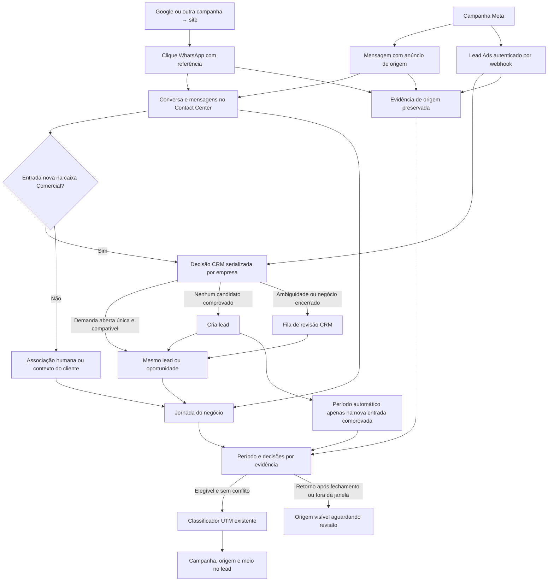

# Jornada comercial e origem do lead

A conversa é do Contact Center. Um lead representa um negócio; um cliente pode ter
vários negócios e falar em várias caixas. A Jornada, no formulário do lead, separa
conversas vinculadas ao negócio de outras conversas do cliente cadastrado na mesma
empresa. Essa segunda área exige empresa e parceiro e não procura pelo telefone. A
cadeia detalhada Website aparece somente nas conversas vinculadas ao negócio; outras
conversas do cliente não expõem o snapshot privado de aquisição nesta tela.

Na origem Website, aquisição, clique e mensagem têm datas independentes. A campanha
continua com a data de aquisição; a mensagem que prova a associação determina o negócio.
Mensagem exatamente no fim de um período pertence somente ao período que começa naquele
instante. Os jobs de associação e vínculo de negócio convergem em páginas limitadas, nas
duas ordens. Enquanto pendentes, a classificação aguarda.

A Jornada distingue código recebido de associação confirmada pela equipe, além de
sugestão sem crédito, período em revisão, origem fora do período e captura legada.
Campanha informada por UTM difere de ID resolvido no catálogo local. Ambiguidade e
ausência de catálogo são explícitas; nenhum desses dados prova o anúncio exato. Editar
ou apagar a mensagem depois do recebimento preserva a associação histórica; descartá-la
explicitamente na revisão retira o crédito desta origem.

Na ausência de uma data de aquisição comprovada, a tela identifica o horário do clique
como referência temporal e informa a procedência disponível (URL, visita ou cookie).
Datas ausentes não são confundidas com o fim em aberto de um período.

Para usuários com leitura Marketing, “Ver evidência da associação” abre a evidência
autorizada. Dela é possível navegar ao clique e ao visitante. O botão Jornada do
visitante exige leitura nativa e administração Contact: lista visitas/campanhas mesmo
sem clique, conversas e negócios visíveis com paginação. Toda navegação revalida as
permissões atuais.

O agente com acesso nativo ao lead e à conversa vê nomes de campanha/anúncio, origem,
meio e datas, mesmo sem leitura Marketing. Essa projeção não contém IDs de anúncio, URLs
brutas, visitante, IP ou identificadores de clique. Páginas adicionais conservam essa
restrição. A evidência detalhada e o catálogo mantêm suas permissões próprias. Visitas
aceitam os hosts da binding ativa; falta de domínio/origem confiável aparece como
configuração pendente, sem afirmar que não houve visitas.

A área separada “Possíveis outros acessos” compara apenas a última observação válida de
IP no mesmo site, em até 24 horas antes/depois, ordenada por proximidade. Exibe as duas
datas; não unifica pessoas, visitas ou crédito. Uma rede pode ser compartilhada. Login e
fusão nativa de contatos preservam a cadeia apenas no mesmo site/empresa; visitantes
removidos deixam uma lacuna explícita sem inventar nova campanha.

Retenção e recusa explícita apagam as cópias privadas e revogam somente a autoridade
Website-WhatsApp, preservando outras origens e UTMs manuais. A recusa é assíncrona e
limitada à decisão identificada pelo cookie atual; decisões anteriores substituídas
seguem retenção. Expiração do recibo ou pausa da captura após a projeção preserva o
crédito histórico. Legado não recebe projeção retroativa. Leads sem empresa podem ser
contexto em várias empresas; esta autoridade Website não cria crédito nem escolhe sua
empresa Marketing. Outros fluxos existentes do Base podem já ter fixado essa empresa.

Vínculos antigos ficam **legado: revisar período**, com escritor indeterminado. Novas
associações humanas e de Automation ficam **contexto**. Automation não confirma período
comercial. Confirmação/revisão aposenta a linha anterior, preserva sua vigência e cria
uma sucessora com ator/data da decisão separados da origem da associação. Repetir a
mesma janela não cria outra linha.

Sobreposição com outro negócio confirmado é bloqueada sem revelar qual negócio ou suas
datas. Um responsável CRM com acesso aos negócios e à caixa deve resolver. Merge
inequívoco de duplicatas conserva a linha; períodos diferentes ou transferência de
confirmação exigem revisão. A conversão nativa preserva o ID do negócio.

A confirmação preserva a projeção Kanban. Desvincular o documento somente do caso Kanban
preserva o vínculo da conversa com o negócio. Desvincular a conversa no painel CRM
remove essa projeção e revoga as autoridades de aquisição da conversa e
`website.whatsapp` ligadas àquela geração do vínculo neste negócio. Autoridades
independentes, como formulário Website (`website.form`) e Meta Lead Ads, permanecem.
Nenhuma classificação manual é substituída.

Nos vínculos antigos, `scope_review` conserva a tupla UTM e o último recibo aplicado.
Nos períodos da nova entrada automática, uma origem pendente não preserva uma tupla
automática cuja própria evidência foi revogada, apagada ou deixou de ser elegível. Uma
origem anterior ainda válida pode continuar classificando enquanto outra aguarda
revisão. Uma edição manual dos campos UTM sempre prevalece. Ele cobre origens antigas
sem período, merge em revisão e convergência ainda incompleta. Excluir uma conversa
preserva sua aquisição bruta: origens órfãs exigem decisão explícita do administrador
Marketing nos campos UTM ou a reversão existente, quando permitida. Não existe promessa
de reabrir uma conversa excluída.

A listagem não carrega mensagens. Conversa restrita revela apenas sua existência. Abrir
chat revalida o negócio, sua relação com a conversa e o acesso à caixa. Histórico de
atribuições/estados respeita ACL e membership de supervisão; agentes sem essas
permissões veem “histórico restrito”. A primeira data registrada indica cobertura, sem
inferir responsáveis antigos ou autores de mensagens externas.

## Entrada automática nas caixas comerciais

P3 permite habilitar a entrada automática por caixa WhatsApp. A primeira mensagem humana
de uma conversa nova agenda um worker: ele reutiliza um único negócio aberto da mesma
empresa, com contato ou telefone completo comprovado, ou cria um lead. Ambiguidade,
negócio restrito e identidade insuficiente exigem revisão. A conversa permanece no
Contact Center. A política separada **Origem automática em novos leads** confirma o
período somente para uma criação nova comprovada; reuso e ambiguidades conservam
contexto. Campanha é preenchida apenas quando a evidência é elegível e inequívoca. Veja
[configuração e recuperação](crm-intake.md).

Suporte e financeiro permanecem sem essa regra. Receita/ROAS exige P4: leitores
financeiros opcionais ainda usam relações de documentos/eventos com CRM, sem aplicar
este gate de aquisição.

## Validação e atualização

Atualizar conjuntamente Contact CRM/Kanban/Sales e Marketing Base/Contact/Google/
Website-WhatsApp/Automation instalados. Odoo inicializa novas colunas antigas como
`legacy`/`unknown`; a prova de upgrade cobre linhas ativas e aposentadas, NOT NULL e
CHECK da janela. Não rodar o backfill histórico de extração neste esquema. Seguir branch
oficial e runbook de implantação, respeitando a autorização de backup de cada entrega;
testes locais não são deploy.

O coletor `operations/ingest_readonly.py` aceita somente leitura RPC e grava um novo
arquivo sanitizado. Inclui denominadores e janela UTC. Retry de job difere de `attempts`
persistido no evento; falha terminal não comprova mensagem ou lead perdido. Ele não
reprocessa fila nem modifica política de retry/retenção.

## Revisão de retorno e duplicidade

A primeira conclusão/arquivamento/etapa ganha do negócio fica na auditoria do período
automático. Entrega atrasada de uma mensagem anterior ao fechamento conserva sua data
real. Interações posteriores ficam visíveis para revisão: incluir exige negócio aberto e
período que contenha aquela ocorrência; excluir retira somente seu crédito. A decisão
vale para a evidência opaca, negócio e geração atuais, sem herança para outro negócio.

Meta Lead Ads e WhatsApp podem representar a mesma demanda. A política por empresa usa
telefone completo comprovado e recibos privados para reconciliar as duas ordens de
chegada dentro da janela. Múltiplos negócios, origens incompatíveis, pares brasileiros
com/sem nono dígito e alvo excluído exigem decisão. Não há merge retroativo por IP,
telefone ou nome. O lead concentra o negócio e as UTMs; mensagens continuam na conversa,
acessíveis pela Jornada, sem cópia do chat no chatter do lead.

A decisão arquitetural está registrada em
[Lead como centro do negócio](adr-lead-commercial-hub.md).
