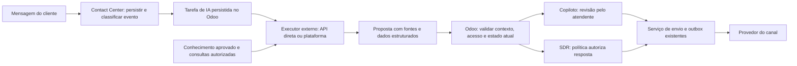

**Avaliação independente — IA no Contact Center / Odoo 16 — 10/09/2026**

Minha recomendação é manter o Contact Center como centro da operação, desenvolver a integração de IA e reaproveitar um motor existente quando ele reduzir trabalho. O ponto de partida preferido é um addon pequeno, um executor externo e API de modelo; Dify é uma alternativa relevante se a equipe precisar administrar conhecimento e fluxos visualmente. A decisão sobre quem controla a conversa é independente da escolha de quem executa o modelo.

Esta é uma avaliação para discussão, não uma decisão de implantação. Foram lidos o texto anexado pelo usuário, o código local, registros operacionais, o ICP e fontes públicas primárias. Não foram acessados os servidores nem executadas chamadas de IA com conversas de clientes. O checkout local tinha HEAD `5bd6381eb93809a25629e13ce0f03d6b92677fd7`, de 10/09/2026, e alterações preexistentes; seus detalhes não comprovam o estado instalado. Nenhum módulo foi instalado ou alterado nesta avaliação.

O produto deve atender três usos com contextos e permissões próprios:

| Uso | Entrega concreta | Primeiro limite de autonomia |
| --- | --- | --- |
| Copiloto do atendente | Resumir a conversa, sugerir resposta, encontrar documentação, apontar dados faltantes e próxima ação. | O humano revisa e envia; alterações no CRM são propostas revisáveis. |
| Assistente interno e de gestão | Responder dúvidas de produto/processo e consultar oportunidades, propostas e pendências autorizadas. | Consultas de leitura, com fontes, período e cobertura dos dados. |
| SDR de atendimento | Recepcionar contatos que chegam, entender o projeto, esclarecer questões aprovadas e entregar uma oportunidade qualificada ao comercial. | Escopo comercial delimitado, passagem para humano e autorização de envio controlada pelo Odoo. |

Prospecção ativa, cadências, campanhas em massa e negociação autônoma constituem ampliações posteriores. O primeiro SDR proposto atende demanda recebida. O assistente interno pode começar junto com o copiloto; não depende do lançamento do SDR.

O objetivo comercial mais concreto vem do [ICP provisório](../../../../marketing/strategy/icp-reconstruction-2026-08-29.md): faltam dados confiáveis de empresa, interlocutor, aplicação, escala, prazo e orçamento. Eu priorizaria aplicação, localização, potência/quantidade, fase do projeto e prazo, aproveitando informações já fornecidas; empresa, papel do interlocutor e demais campos entram progressivamente. O bot deve encaminhar cedo quando há intenção clara de orçamento, sem exigir um formulário inteiro na conversa.

Cada dado extraído precisa guardar mensagem de origem, data, unidade e estado de confirmação. Uma hipótese do modelo deve permanecer distinta de uma declaração do cliente. Valores conflitantes exigem revisão; uma extração não deve sobrescrever silenciosamente informação validada. A concentração histórica no Sul/Sudeste e a presença de estruturas fotovoltaicas sustentam investigação, não exclusão automática de outras regiões ou aplicações. O próprio ICP alerta que a média de R$ 33.395,56 é por pedido no subconjunto vinculado ao CRM, não ticket geral por cliente nem medida de margem.

**Há pontos sólidos no anexo, mas alguns fundamentos precisam de correção.** Preservar o outbox, começar com assistência humana, usar API de modelo e limitar promessas comerciais são boas direções. As diferenças que mudam a decisão são:

| Afirmação ou implicação do anexo | Minha avaliação |
| --- | --- |
| Um produto externo exige furar o outbox ou criar outra caixa. | Não necessariamente. Um motor pode receber contexto por API e devolver proposta estruturada ao Odoo. Dify e EvoAI permitem esse desenho; a integração específica continua necessária. |
| OCA/ai é apenas webhook síncrono. | Há modo de resultado assíncrono com callback. O POST inicial ainda pode esperar até 30 segundos na transação, e o caminho de resposta em mensagem usa chatter. São pontos a adaptar, não prova de que a biblioteca seja inutilizável. |
| Criar `root.contact_center.ai` tira o LLM dos workers do ERP. | Não. No runner padrão OCA, o job é executado por uma requisição HTTP a um worker Odoo. Um canal limita concorrência, sem criar isolamento de execução. |
| Falta saber onde roda o runner produtivo. | O registro da instalação de 08/09 já informa runner somente no serviço principal, com `root:1`. É evidência documental a revalidar antes de implementar. |
| Basta mudar a origem de `agent` para `automation`. | A opção `automation` já existe, mas reconciliação de sucesso, retentativas e outros caminhos fazem pressupostos sobre `agent`. É uma mudança de contrato transversal. |
| O painel CRM é uma substituição que inevitavelmente colidirá com IA. | A extensão atual condiciona o painel padrão e insere o CRM por herança. Uma extensão mal desenhada pode colidir; a colisão não é inevitável. |
| Não há Apps v16 relevantes. | Existem ofertas que anunciam copiloto, resposta automática e transferência para humano. A existência comercial não prova qualidade, compatibilidade com a suíte ou confiabilidade operacional. |
| Modo sombra tem risco nenhum. | Evita enviar respostas ao cliente, mas ainda envolve custo, acesso e eventual transmissão de dados ao fornecedor do modelo. |

O [bridge OCA](https://github.com/OCA/ai/blob/80c64ac30e1b67c28a16a469621e01a22948bb38/ai_oca_bridge/models/ai_bridge.py#L71) e o [modelo de execução](https://github.com/OCA/ai/blob/80c64ac30e1b67c28a16a469621e01a22948bb38/ai_oca_bridge/models/ai_bridge_execution.py#L88) sustentam a distinção entre requisição inicial e resultado assíncrono. O [runner OCA](https://github.com/OCA/queue/blob/16.0/queue_job/jobrunner/runner.py) documenta execução via `/queue_job/runjob`. Localmente, o [registro da instalação produtiva](../../../incidents/2026-09-08-contact-center-official-install.md) confirma `root:1`, e o [registro dos workers](../../../../infra/incidents/2026-09-07-odoo-workers-producao.md) registra dois workers HTTP no principal. Um job longo de IA sob esse mesmo limite global pode atrasar inbox/outbox, mesmo em um subcanal próprio.

**As alternativas têm funções diferentes e devem ser comparadas pelo trabalho que economizam.** A compatibilidade citada abaixo vem de código ou documentação; nenhum produto externo foi instalado para esta avaliação. Esforços são estimativas relativas para preservar a suíte existente.

| Alternativa | O que pode ser aproveitado | Encaixe e custo de adaptação estimado |
| --- | --- | --- |
| Integração própria + executor com API direta | Contrato enxuto, ferramentas específicas, política e testes ajustados à Soloz. | Minha preferência inicial para poucos fluxos estáveis. Esforço moderado de desenvolvimento e responsabilidade própria por operação; evita acrescentar uma plataforma inteira. |
| [OCA/ai 16.0](https://github.com/OCA/ai/tree/80c64ac30e1b67c28a16a469621e01a22948bb38) | 11 módulos Beta, AGPL-3; bridge, ferramentas e MCP. | Candidato real para reaproveitar configuração e ferramentas internas. Esforço moderado no bridge do Contact Center; não entrega sozinho SDR e passagem para humano. |
| [Apexive/odoo-llm 16.0](https://github.com/apexive/odoo-llm/tree/16.0) | Providers, assistentes, ferramentas e RAG. Núcleo/providers LGPL-3; há conectores AGPL-3. | Candidato secundário. Estrutura mais ampla e esforço moderado/alto para adaptar, validar dependências e corrigir lacunas do provider escolhido. |
| [Dify](https://docs.dify.ai/en/api-reference/guides/get-started) | Apps e conhecimento acessíveis por REST, com administração visual. | Minha principal alternativa ao executor direto se a equipe mantiver conteúdo e fluxos pela UI. Exige integração no Odoo e operação de plataforma. |
| [n8n](https://docs.n8n.io/integrations/builtin/app-nodes/n8n-nodes-base.odoo) | Integração Odoo, orquestração e tarefas em lote; já consta no inventário. | Útil para insights, avaliação e enriquecimento; pode operar fluxos produtivos delimitados. Guardar estado comercial e decisão de envio no Odoo reduz ambiguidades. |
| [EvoAI standalone](https://github.com/evolution-foundation/evo-ai) | Motor FastAPI/ADK, ferramentas e APIs, Apache-2.0. | Pode funcionar como executor sem outra inbox. O runtime instalado e suas interfaces ainda precisam ser identificados. |
| [Chatwoot Captain](https://www.chatwoot.com/pricing/self-hosted-plans) | Assistência dentro do ecossistema Chatwoot. | Menor encaixe: há sobreposição de conversa, atendimento e estado. Integração por API é possível, mas sua vantagem precisa compensar a ponte entre sistemas. |
| [TechUltra v16](https://apps.odoo.com/apps/modules/16.0/ai_whatsapp_chatbot) e [Aski v16](https://apps.odoo.com/apps/modules/16.0/jjro_whatsapp_ai) | TechUltra anuncia Cloud API e RAG; Aski anuncia copiloto, resposta automática, resumo e handoff. OPL-1. | Ofertas comerciais reais, dependentes da pilha WhatsApp de cada fornecedor; Aski anuncia inbox próprio. Adaptação alta/incerta, sujeita a demonstração e contrato. |
| [Agentes Odoo 19](https://www.odoo.com/documentation/19.0/applications/productivity/ai/agents.html) e [AI Live Chat](https://www.odoo.com/documentation/19.0/applications/productivity/ai/live-chat.html) | Referência funcional para agentes, fontes e ferramentas. | Relevante para planejamento de evolução do ERP. Não é instalação direta no v16; backport ou migração têm esforço muito alto para este objetivo isolado. |

Na Apexive, o [último commit verificado da branch 16](https://github.com/apexive/odoo-llm/commit/a6a229d94ab5aa2d99d8de88ef290b85284258f3) é de 01/05/2026. Isso não demonstra abandono. A leitura do [provider Anthropic](https://github.com/apexive/odoo-llm/blob/a6a229d94ab5aa2d99d8de88ef290b85284258f3/llm_anthropic/models/anthropic_provider.py#L20) mostra um caminho de chat textual, sem ciclo completo de ferramentas; faltam métodos esperados pelo [dispatch do núcleo](https://github.com/apexive/odoo-llm/blob/a6a229d94ab5aa2d99d8de88ef290b85284258f3/llm/models/llm_provider.py#L45). É motivo para homologar/corrigir o caso de agentes, sem afirmar que toda conversa simples necessariamente falha.

A [licença do Dify](https://github.com/langgenius/dify/blob/main/LICENSE) é Apache modificada: permite backend comercial, com restrições para múltiplos tenants/workspaces e para alterações de marca no frontend. A [licença do n8n](https://raw.githubusercontent.com/n8n-io/n8n/master/LICENSE.md) admite uso interno sob Sustainable Use License, com componentes Enterprise separados. Licença aberta ou código disponível não equivale a custo operacional zero.

Os valores US$ 19/99 da [página self-hosted do Chatwoot](https://www.chatwoot.com/pricing/self-hosted-plans) identificam planos por agente/mês, com cobrança anual, que incluem Captain; não são uma faixa universal do preço isolado da IA. O [inventário do SERVIDOR04](../../../../infra/servers/servidor04.md) registra n8n, Chatwoot e Evo CRM Community. Este último não deve ser confundido com uma instalação comprovada do EvoAI standalone.

Também não é preciso concluir que SaaS nacionais não tenham integração possível: APIs e serviços de adaptação podem existir. Para Blip, Zenvia, Octadesk ou similares, o fornecedor teria de demonstrar funcionamento com a inbox atual, custo total, exportação de dados, passagem para humano e contrato de envio. Não houve homologação nem cotação desses produtos nesta avaliação; não há base para afirmar ausência universal de conectores.

A afirmação de que toda IA nativa começou no Odoo 19 também é ampla: as [notas do Odoo 17](https://www.odoo.com/odoo-17-release-notes) já anunciam geração/melhoria de texto. O conjunto de agentes e Live Chat aqui comparado é documentado no 19; edição e licença dos módulos precisam ser verificadas antes de considerar um backport.

**A arquitetura proposta mantém a autoridade no Odoo.** O executor de IA recebe uma tarefa persistida, trabalha fora da requisição do ERP e devolve uma proposta. O Odoo decide se ela ainda pode ser aplicada.

Um desenho inicial possível usa `contact_center_ai` para configurações, execuções, estados, auditoria e assistência na interface; `contact_center_ai_crm` fica com qualificação e propostas de alteração no CRM. Nomes e divisão são sugestões. Um cliente de modelo compartilhado evita implementar motores diferentes para cada uso. Marketing Center e Kanban não precisam ser dependências do primeiro piloto; a instalação oficial documentada não os incluía.

O executor pode buscar tarefas por uma API restrita do addon, com reserva temporária e prazo, concluir cada tarefa com chave idempotente e permitir retomada após falha. Outra opção é despachar rapidamente para um serviço durável e receber callback autenticado. Em ambas, o processo que aguarda o modelo é externo; o callback valida identidade, tarefa, versão e duplicação. Um processo Odoo dedicado também é possível, mas exige definir roteamento de jobs, runner, capacidade de banco e isolamento real. Criar outro runner sem essa análise não é uma solução.

A inspeção do código aponta estes trabalhos concretos:

| Área | Trabalho necessário |
| --- | --- |
| Entrada | Um gancho após projeção da mensagem pode criar a tarefa. Filtrar inbound externo elegível, caixa habilitada e marco de ativação; impedir disparos por eco, importação histórica, nota interna, status ou repetição. Agrupar mensagens curtas consecutivas antes de responder. |
| Envio | Reutilizar o serviço validado de envio/outbox, com ator técnico limitado às caixas permitidas. A API atual é uma referência útil; expor um contrato próprio evita depender permanentemente de detalhes da UI. |
| Autoria | Tratar `automation` em envio, retentativa, evidência do provedor, reconciliação e métricas. Distinguir autoria automática, envio humano e assistência ao rascunho. |
| Passagem para humano | A ação de assumir e uma resposta humana devem invalidar execuções antigas e cancelar saídas automáticas ainda pendentes. Revalidar novamente antes do início efetivo do envio. Uma mensagem já aceita pelo provedor não pode ser considerada cancelada por mudança posterior de estado. |
| Concorrência | Vincular a resposta à versão da conversa, último inbound e versão da política. Se o cliente ou atendente falar durante a geração, reavaliar ou descartar a proposta antiga. |
| UI | Acrescentar ações de resumir, sugerir e perguntar; apresentar fontes e dados extraídos. O rascunho não deve substituir texto digitado enquanto a IA respondia. |
| CRM | Aplicar alterações por métodos específicos, com campos permitidos, evidência e revisão. Manter os contratos existentes de identidade, vinculação e atribuição. |

Evidências de código: [`application.py`](../contact_center_base/models/application.py), em `_post_inbound`; [`application_outbound.py`](../contact_center_base/models/application_outbound.py), em `_send_message`; [`message.py`](../contact_center_base/models/message.py), na seleção de origem; [`queue.py`](../contact_center_base/models/queue.py), especialmente `_provider_success_reconciliation_evidence` e a barreira de despacho; e [`ui_api.py` do CRM](../contact_center_crm/models/ui_api.py), em `get_customer_records`. As alterações precisam de testes de comportamento, não apenas confirmação de que a API retorna sucesso. Estado de controle pela IA deve permanecer separado dos estados `open/resolved/archived` da conversa e do responsável comercial.

**Conhecimento comercial e dados vivos exigem fontes diferentes.** Especificações, aplicações, FAQ e limites de resposta devem vir de material aprovado e versionado. Preço, estoque, proposta e prazo registrado vêm de consultas atuais ao Odoo, quando o usuário tem permissão. Histórico de conversas ajuda a entender contexto e avaliar o piloto; não deve virar automaticamente verdade técnica ou comercial.

Uma base pequena pode começar com documentos curados e busca simples. RAG passa a valer quando quantidade, atualização ou necessidade de localizar trechos justificarem indexação. Mesmo antes disso, cada resposta factual deve permitir rastrear a fonte. Para insights gerenciais, o backend calcula números com filtros e denominadores definidos; o modelo explica o resultado. Ele não deve inventar totais ou interpretar a falta de motivo de perda como uma causa comprovada.

O copiloto herda o acesso do atendente. O assistente gerencial consulta apenas os dados daquele perfil. O SDR externo recebe um subconjunto publicável: o fato de um vendedor enxergar margem, notas internas ou outra conversa não autoriza transmiti-las ao cliente. O modelo propõe ações; permissões e validações são aplicadas por código, inclusive diante de instruções maliciosas no texto recebido. Falha, timeout ou fonte insuficiente precisam produzir espera controlada ou transferência para humano.

Para consultas internas em uma interface de IA já utilizada pela equipe, [erpipe-org/mcp-odoo](https://github.com/erpipe-org/mcp-odoo) é candidato: o projeto MIT anuncia suporte Odoo 16+, XML-RPC, ferramentas de leitura e controles de escrita. Eu começaria com usuário restrito, lista explícita de modelos/campos/ferramentas e escrita desativada. MCP facilita conectar ferramentas; ainda é necessário verificar se suas leituras respeitam o escopo específico das caixas e dados acessíveis de cada usuário.

**Canal oficial e custo devem ser avaliados com as regras atuais.** Eu manteria o piloto autônomo em Messenger/Instagram já integrados, se adequados à demanda e com permissões efetivas, ou em WhatsApp Cloud com um adapter próprio. Um número dedicado reduz o impacto de migração sobre o atendimento existente. WuzAPI continua sendo transporte não oficial; minha recomendação de canal oficial para automação comercial é operacional, não uma afirmação de que o uso atual foi aprovado pela Meta.

Os [termos atuais do WhatsApp](https://www.whatsapp.com/legal/business-solution-terms/) permitem contratar fornecedor de IA sob condições e contêm exceções para números do EEE e Brasil na cláusula de AI Providers. Logo, a descrição do anexo baseada apenas na restrição de janeiro está incompleta. Os mesmos termos impõem limites ao uso dos dados para treinamento; contratar uma API de IA não elimina a necessidade de verificar esse tratamento.

Não foi corroborada, nas fontes primárias recuperadas nesta avaliação, a alegação de cobrança de cada mensagem de atendimento a partir de 01/10/2026. A [página oficial de preços](https://business.whatsapp.com/products/platform-pricing) e a [documentação técnica de pricing](https://developers.facebook.com/documentation/business-messaging/whatsapp/pricing) devem orientar o orçamento por categoria, país, janela e eventual tarifa do intermediário. Portanto, não adoto os US$ 0,007 por mensagem nem os US$ 0,10 por qualificação do anexo como custo confirmado.

A gratuidade de entrada por Click-to-WhatsApp exige resposta da empresa em até 24 horas para abrir a janela gratuita de 72 horas. A janela de atendimento é independente: após 24 horas sem nova mensagem do usuário, ainda se exigem templates, mesmo dentro do período gratuito. O anúncio é custo separado. Fonte: [documentação técnica de preços](https://developers.facebook.com/documentation/business-messaging/whatsapp/pricing).

A [documentação operacional da 360dialog](https://docs.360dialog.com/docs/resources/phone-numbers/coexistence.md) descreve coexistência do WhatsApp Business App com Cloud API e desvinculação de dispositivos no onboarding. Isso não comprova suporte ou preservação de WuzAPI. O [próprio projeto WuzAPI](https://github.com/asternic/wuzapi/blob/main/README.md) adverte sobre bloqueio em usos que violem termos e indica API oficial para aplicação comercial; não estabelece taxa de banimento nem demonstra que IA, isoladamente, cause bloqueio.

Enviar dados pessoais para processamento fora do país pode caracterizar transferência internacional: finalidade, minimização, retenção, contrato e mecanismo aplicável devem integrar a escolha do fornecedor, conforme a [orientação da ANPD](https://www.gov.br/anpd/pt-br/assuntos/assuntos-internacionais/transferencia-internacional-de-dados). Em relações às quais o CDC se aplica, o [art. 30](https://www.planalto.gov.br/ccivil_03/leis/l8078compilado.htm) trata da vinculação de ofertas suficientemente precisas. Isso reforça limitar promessas de preço, prazo, dimensionamento e garantia; não significa que toda fala de um bot, em qualquer relação B2B, tenha automaticamente o mesmo enquadramento.

**O custo precisa ser medido por atendimento útil.** Os preços de Opus 5 citados no anexo foram confirmados, mas o custo por conversa depende do histórico reenviado, raciocínio, ferramentas, retentativas e cache. Para tornar a ordem de grandeza verificável, este cenário supõe 50 mil tokens de entrada acumulados e 5 mil de saída por qualificação, sem cache:

| Modelo | Entrada/saída por milhão, USD | Custo calculado por qualificação | 1.000 qualificações |
| --- | --- | --- | --- |
| Haiku 4.5 | 1 / 5 | US$ 0,075 | US$ 75 |
| Sonnet 5 | 2 / 10 | US$ 0,150 | US$ 150 |
| Opus 5 | 5 / 25 | US$ 0,375 | US$ 375 |

Fórmula: `(tokens de entrada × tarifa de entrada + tokens de saída × tarifa de saída) / 1.000.000`. Tarifas consultadas em 10/09/2026 na [tabela da Anthropic](https://platform.claude.com/docs/en/about-claude/pricing). Os totais são cenários calculados, não medições da Soloz. Não incluem áudio, ferramentas cobradas, canal, infraestrutura, assinatura de plataforma, impostos, câmbio, engenharia ou revisão humana. A escolha do modelo deve comparar qualidade em português e no domínio comercial, latência e custo no mesmo conjunto de casos.

**O piloto proposto deve produzir evidência antes de ampliar autonomia.**

1. No SERVIDOR05, implementar o contrato mínimo de execução e três ações: resumir conversa, sugerir resposta com fonte e extrair qualificação revisável. Preparar material comercial aprovado e uma amostra de avaliação sanitizada. O laboratório deve ter saída bloqueada para clientes e tarefas identificadas pelo ambiente, pois a base é uma cópia.
2. Comparar o executor direto com apenas uma alternativa, conforme necessidade: Dify para administração visual de conhecimento; OCA para reaproveitamento integrado ao Odoo. Usar as mesmas conversas, fontes, tarefas e critérios, sem implantar várias plataformas em paralelo.
3. Liberar o copiloto a um pequeno grupo e registrar aceitação das sugestões, correções, tempo até envio e qualidade dos dados extraídos. O assistente interno pode avançar em paralelo com ferramentas de leitura restritas.
4. Rodar o SDR em sombra em conversas elegíveis, avaliando qual seria a próxima resposta e quando deveria transferir para humano. A comparação precisa de revisão comercial; discordar do histórico humano não significa automaticamente erro do modelo.
5. Ativar uma caixa oficial e um escopo limitado de atendimento. Medir oportunidades aceitas pelo vendedor e qualidade da qualificação, além da velocidade. Expandir por evidência, com suspensão por caixa e rastreabilidade de cada execução.

Um conjunto inicial de 100–200 casos é uma proposta prática, não certificação de segurança. Ele deve cobrir contato novo, cliente recorrente, orçamento urgente, dados conflitantes, mídia ainda indisponível, pedido de humano, repetição de webhook, timeout, resposta humana durante geração e tentativa de obter dados indevidos. Passagem para humano, ausência de duplicação e isolamento de acesso precisam passar integralmente nos cenários controlados. Métricas comerciais incluem completude correta de dados, aceitação pelo vendedor, tempo até oportunidade e custo por oportunidade aceita; taxa de resposta automática sozinha não mede sucesso.

O roadmap de 02/09 tratava IA generativa como fora da decisão de produto naquele ciclo. A solicitação atual autoriza explorar essa possibilidade. Uma implementação posterior deve registrar o novo escopo no planejamento do projeto; a nota antiga não impede esta avaliação. A proposta preserva o atendimento já construído e permite trocar o motor de IA conforme resultados do piloto.
